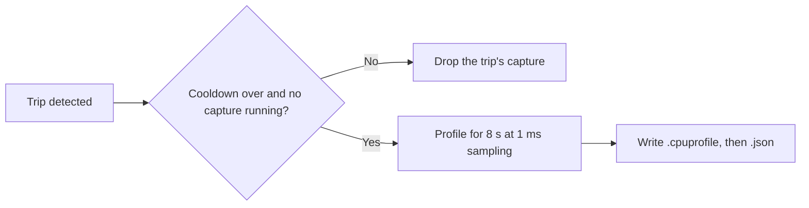

Xum has built-in tools to find out why the app or its backend is slow. All of them are opt-in, except hang stacks on the desktop app.

| Tool                                              | Turn on                                    | Output                                                                   | Safe to share?                                                                     |
| ------------------------------------------------- | ------------------------------------------ | ------------------------------------------------------------------------ | ---------------------------------------------------------------------------------- |
| [Flight recorder](#flight-recorder)               | Experiment **Performance flight recorder** | In-memory samples, read with `xum api perf get-flight-recorder-snapshot` | Yes, after review. It contains procedure names, script URLs and function names.    |
| [Triggered CPU profiles](#triggered-cpu-profiles) | Same experiment                            | `.cpuprofile` and `.json` files in `~/.xum/perf/captures/`               | Yes, after review. Profiles contain function names and script paths or URLs.       |
| [Hang stacks](#hang-stacks-desktop)               | Always on (desktop app)                    | `[diag]` lines in `~/.xum/logs/mux.log`                                  | Yes, after review.                                                                 |
| [Offline analyzer](#offline-analyzer)             | Run it from a Xum source checkout          | Markdown, JSON or folded stacks                                          | Yes, after review. It shows function names and source locations from the profiles. |
| [Session tapes](#session-tapes)                   | Experiment **Session tapes**               | JSONL files in `~/.xum/perf/tapes/`                                      | No. Tapes contain your full chat.                                                  |

Paths on this page use `~/.xum`, the default Xum home. If you set `XUM_ROOT`, Xum uses that folder instead.

## Run `xum api` commands

Most steps on this page use `xum api <namespace> <procedure>`. Namespace and procedure names are kebab-case, and input fields become kebab-case flags, for example `xum api perf-captures capture-now --process backend`.

`xum api` talks HTTP to a running Xum backend. It finds the backend in this order:

1. `XUM_SERVER_URL` and `XUM_SERVER_AUTH_TOKEN`, when set.
2. `server.lock` in the Xum home. The desktop app writes it for its local API server (127.0.0.1, random port), unless you set `XUM_NO_API_SERVER=1`. `xum server` also writes it.
3. `http://localhost:3000`.

Keep the desktop app or `xum server` running while you use these commands.

## Flight recorder

The flight recorder keeps the last 10 minutes of performance samples in memory: backend event-loop delay, garbage collection and heap, renderer long frames and slow interactions, and oRPC call timings. It works for the desktop app and for `xum server`.

### Turn it on

Open **Settings → Experiments** and turn on **Performance flight recorder**. Or run:

```bash
xum api experiments set-override --experiment-id perfFlightRecorder --enabled
```

To turn it off, run:

```bash
xum api experiments set-override --experiment-id perfFlightRecorder --enabled false
```

The change takes effect at once. No restart is needed. Xum stores the setting in `feature_flags.json` in the Xum home.

Turning it off stops collection. The samples already recorded stay readable until they are 10 minutes old. A restart clears everything.

### Read the samples

```bash
xum api perf get-flight-recorder-snapshot > snapshot.json
```

Redirect the output to a file as shown. Piped `xum api` output can stop early, so `jq` then reports incomplete JSON.

This command works while the recorder is off. Check `state` first: `collecting` means the recorder runs, `off` means it is off, and `failed` means it stopped with an error in `failure`.

Useful filters:

```bash
# Detected stalls, slow frames and slow calls
jq '.trips' snapshot.json

# Event-loop delay for the last 5 seconds
jq '.backend.samples[-5:] | map({atMs, p99Ms: .loopDelay.p99Ms, maxMs: .loopDelay.maxMs})' snapshot.json

# oRPC procedures with the slowest p99 over the last 60 s
jq '.rpc.procedures | sort_by(-(.window.p99Ms // 0)) | .[:10]' snapshot.json
```

Timestamps (`atMs`, `startMs`, `endMs`, `nowMs`) are milliseconds on the performance clock (`performance.timeOrigin + performance.now()`). Compare them with `nowMs` to see how old an entry is.

<Accordion title="What the snapshot contains">

Top-level keys: `version`, `state`, `nowMs`, `failure` (only when `state` is `failed`), `backend`, `renderer`, `trips`, `rpc`.

| Key                                              | Content                                                                                                                                                                                                                                                                                                                                                                                                                                        |
| ------------------------------------------------ | ---------------------------------------------------------------------------------------------------------------------------------------------------------------------------------------------------------------------------------------------------------------------------------------------------------------------------------------------------------------------------------------------------------------------------------------------- |
| `backend.samples`                                | One sample per second. `loopDelay`: `p50Ms`, `p99Ms`, `maxMs`, `minMs`, `sampleCount`, measured with a 20 ms resolution. The resolution is part of each reading, so an idle event loop reads about 20 ms. `samplerLagMs`: how late the sampler itself ran. `elu`: event-loop utilization (`utilization` 0 to 1, `activeMs`, `idleMs`). `gc`: `count`, `totalMs`, `maxMs`, and `byKind` (`minor`, `major`, `incremental`, `weakcb`, `unknown`). |
| `backend.heap`                                   | One sample every 10 s: `usedBytes`, `totalBytes`, `limitBytes`.                                                                                                                                                                                                                                                                                                                                                                                |
| `renderer.loaf`                                  | Long Animation Frames, as reported by the browser (50 ms or longer by default). Frame fields: `durationMs`, `blockingDurationMs`, `renderStartMs`, `styleAndLayoutStartMs`. Up to 8 `scripts` per frame: `sourceURL`, `sourceFunctionName`, `sourceCharPosition`, `invoker`, `invokerType`, `durationMs`, `forcedStyleAndLayoutDurationMs`.                                                                                                    |
| `renderer.events`                                | Slow interactions of 40 ms or longer: `name`, `durationMs`, `interactionId`, `targetTag`. Xum never records the text content of the target.                                                                                                                                                                                                                                                                                                    |
| `renderer.droppedLoaf`, `renderer.droppedEvents` | Entries that never reached the backend: dropped by the renderer, or in a batch that failed to send.                                                                                                                                                                                                                                                                                                                                            |
| `trips`                                          | Detected problems. See [Trips](#trips).                                                                                                                                                                                                                                                                                                                                                                                                        |
| `rpc.procedures`                                 | Per oRPC procedure path (for example `workspace.sendMessage`): total `count` and `errorCount`, and a `window` with the last 60 s (`count`, `errorCount`, `p50Ms`, `p95Ms`, `p99Ms`, `maxMs`).                                                                                                                                                                                                                                                  |
| `rpc.subscriptions`                              | Per subscription path: `live`, `opened`, `events`, `eventsPerSecond`, and `peakEventsPerSecond` over the last 60 s.                                                                                                                                                                                                                                                                                                                            |
| `rpc.slowCalls`                                  | Calls that took longer than 2000 ms (subscriptions excluded): `path`, `startMs`, `endMs`, `ok`, and `errorCode` for failed calls. Keeps the last 200.                                                                                                                                                                                                                                                                                          |
| `rpc.wsFlowControlWaits`                         | Episodes where WebSocket sends queued behind a full 1 MiB send window: `startMs`, `endMs`, `bufferedBytes`, `maxQueuedFrames`, `closed`. Keeps the last 200.                                                                                                                                                                                                                                                                                   |
| `rpc.windowMs`, `rpc.droppedPaths`               | Length of the rolling window, and procedure paths that did not fit the table.                                                                                                                                                                                                                                                                                                                                                                  |

The renderer sends its entries to the backend every 5 s. It does not send entries from before you turned the recorder on.

oRPC procedure timings cover every transport: HTTP (including `xum api`), WebSocket, and the desktop app's internal MessagePort. Flow-control waits come from WebSocket clients only.

</Accordion>

### Trips

A trip is a detected problem. Xum records it in `trips`, and some trips start a [CPU profile](#triggered-cpu-profiles).

| Trip                   | Condition                                                                                                                                                                                                                    |
| ---------------------- | ---------------------------------------------------------------------------------------------------------------------------------------------------------------------------------------------------------------------------- |
| `loop-delay-p99`       | Two 1 s windows in a row with backend event-loop p99 delay (or sampler lag) above 100 ms. Because readings include the 20 ms resolution, that is about 80 ms of real extra delay. It fires again only after a normal window. |
| `long-animation-frame` | One renderer frame longer than 200 ms.                                                                                                                                                                                       |
| `slow-rpc`             | One oRPC call longer than 2 s.                                                                                                                                                                                               |

### Privacy and cost

The snapshot contains no chat content and no event text. It does contain oRPC procedure names and error codes, script URLs, function names, invoker strings, event names and element tag names.

Each window sends its renderer samples to the Xum backend it is connected to. Samples and profiles stay on the machine that runs that backend unless you share them yourself. For the desktop app, that is your machine. For a browser connected to a remote `xum server`, that is the server. Xum sends nothing to any other service.

When the recorder is off, Xum runs no observers or timers. When it is on, it costs about 1.4 ms of backend CPU per second, mostly for the 20 ms delay histogram. oRPC recording adds well under a microsecond per call. CPU profiles cost more (see below).

## Triggered CPU profiles

When the flight recorder detects a stall, Xum records a short CPU profile of what runs next. The renderer sends long frames to the backend in 5 s batches, so a renderer capture can start several seconds after the frame. These captures are part of the **Performance flight recorder** experiment. There is no separate switch.



| Trip                   | Captures                                                     |
| ---------------------- | ------------------------------------------------------------ |
| `loop-delay-p99`       | The backend.                                                 |
| `long-animation-frame` | The renderer page that reported the frame. Desktop app only. |
| `slow-rpc`             | Nothing. Slow calls usually wait on I/O, not CPU.            |

Rules:

1. Each capture records 8 s at 1 ms sampling.
2. Each trip kind has its own cooldown: 60 minutes for `loop-delay-p99` (backend) captures and 10 minutes for `long-animation-frame` (renderer) captures. The cooldown starts when Xum admits a capture, including captures that end up skipped. The 60-minute backend cooldown trades fewer backend pauses for fewer observations.
3. Only one capture runs at a time. Xum drops trips that arrive during a capture.

A capture shows the activity after the trigger, not the stall itself. Its metadata `label` says `activity after trigger`. Use it to see what work follows a stall, for example repeated renders or retries.

<Warning>
  Starting a backend profile pauses the backend. The pause is about 150 to 250 ms on a fresh `xum
  server`, 0.4 to 0.76 s on a long-running desktop backend, and up to 1.7 s on a loaded machine.
  Profile tools can rank the inspector `post` call high: that is this start pause. Xum ignores its
  own profiler pause when it detects stalls, so one capture does not trigger the next.
</Warning>

### Capture a profile by hand

1. Turn on the flight recorder.
2. Run:

   ```bash
   xum api perf-captures capture-now --process backend --duration-ms 2000
   ```

   `--process` is `backend` or `renderer`. `--duration-ms` is 1000 to 30000 and defaults to 8000. A renderer capture profiles the desktop app's main window.

3. The command returns the capture's metadata when it ends. Check it: `profileFile` names the written profile, and `skippedReason` means Xum could not profile (see the skip reasons below).

Manual captures skip the cooldown. Errors:

- `PRECONDITION_FAILED` with "perf captures need the perfFlightRecorder experiment": turn on the flight recorder.
- `CONFLICT` with "a perf capture is already in progress": another capture is running. Wait and try again.
- `CONFLICT` with "perf capture cancelled": the flight recorder was turned off during the capture. Turn it back on and try again.

### Find captures

```bash
xum api perf-captures list
```

The result is `{ dir, captures }`, newest first. A capture with a profile is two files in `~/.xum/perf/captures/`. A skipped capture (see the skip reasons below) has only the `.json` file.

- `<id>.cpuprofile`: a V8 CPU profile in JSON. Chrome DevTools, speedscope and the [offline analyzer](#offline-analyzer) can read it.
- `<id>.json`: the metadata. Xum writes it last, so a `.json` file means the capture is complete.

An `id` looks like `20261003T013338383Z-1a2b3c4d`. The folder is private to your user (mode 0700, files 0600). For triggered captures, Xum logs `[perfCaptures] captured` (info) when the capture ends and `[perfCaptures] capture failed` (warn) when it fails. Manual captures do not write these lines.

There is no delete command. Delete the files by hand.

<Accordion title="Metadata fields, skip reasons and retention">

Metadata fields: `version`, `id`, `kind` (`loop-delay-p99`, `long-animation-frame` or `manual`), `process` (`backend` or `renderer`), `trigger` (the trip, or `null` for a manual capture), `startedAtMs`, `endedAtMs`, `samplingIntervalUs`, `durationMs`, `xumVersion`, `platform`, `label`, and, when present, `skippedReason`, `profileFile`, `profileBytes`.

When Xum cannot profile, it writes only the metadata file with a `skippedReason`:

| `skippedReason`                  | Cause                                                                          |
| -------------------------------- | ------------------------------------------------------------------------------ |
| `inspector-open`                 | The backend already has an inspector, for example it started with `--inspect`. |
| `devtools-open`                  | DevTools is open on the renderer.                                              |
| `debugger-attached`              | Another debugger is attached to the renderer.                                  |
| `renderer-unknown`               | The page is not a desktop app window, for example a browser tab.               |
| `renderer-unavailable`           | The renderer window is gone.                                                   |
| `renderer-profiling-unavailable` | Renderer profiling is not available, for example on `xum server`.              |
| `failed: <message>`              | The capture failed.                                                            |

Retention: Xum keeps the newest 20 captures that have a profile, within 200 MiB in total (by file modification time), plus up to 20 skipped records. There is no age limit. Xum removes leftover temporary files older than 10 minutes.

</Accordion>

## Hang stacks (desktop)

When the desktop app's main window stops responding, Xum logs where its JavaScript is stuck. This is always on and needs no experiment.

1. Xum logs `[diag] renderer unresponsive`.
2. Xum asks the renderer for its JavaScript call stack, with a 2 s timeout, once per hang.
3. Xum logs `[diag] renderer unresponsive JS stack` with `{url, stack}`, or `[diag] renderer unresponsive JS stack unavailable` with the error.

Find the lines in `~/.xum/logs/mux.log`, or in the [Output tab](/reference/debugging). The log file rotates at 10 MB and keeps `mux.1.log` to `mux.3.log`.

Pop-out windows and browser clients of `xum server` are not covered.

## Offline analyzer

`scripts/perf/analyzeProfiles.ts` ranks the hottest functions in one or more CPU profiles, or compares two sets of profiles. It runs offline, uses no network, and never fetches remote source maps. Run it from a Xum source checkout:

```bash
bun scripts/perf/analyzeProfiles.ts [options] <paths...>
# or
make perf-analyze PROFILES="<paths>" [BASELINE="<paths>"] [PERF_ANALYZE_ARGS="--top 40"]
```

Inputs are files or folders, searched recursively. In a folder the analyzer reads `*.cpuprofile` files, and `*.json` files only when they look like a CPU profile, so it skips capture metadata. It reads V8 CPU profiles from Node, Bun, Chrome DevTools, Xum captures, and the perf E2E `chrome-cpu-profile.json`.

### Example: capture and analyze a backend profile

1. Capture a profile while you reproduce the slow action:

   ```bash
   xum api perf-captures capture-now --process backend --duration-ms 8000
   ```

2. List captures to see the folder:

   ```bash
   xum api perf-captures list
   ```

3. Print the leaderboard:

   ```bash
   bun scripts/perf/analyzeProfiles.ts ~/.xum/perf/captures
   ```

   The output starts with a `# CPU profile hotspots` title and a `Profiles:` summary line. Then it shows time per category (`app`, `node_modules`, `internal`, `extension`, `gc`, `program`, `idle`) and a `Top 25 by self time` table with the columns `# | Function | Location | Category | Self ms | Self % | Total ms | Total % | Samples`. Shares exclude idle time unless you pass `--include-idle`.

4. Write folded stacks and open them in [speedscope](https://www.speedscope.app) or `flamegraph.pl`:

   ```bash
   bun scripts/perf/analyzeProfiles.ts --format folded --out backend.folded ~/.xum/perf/captures
   ```

   Each line is `frame;frame;frame <sampleCount>`, root to leaf. Weights are sample counts, not time. The summary goes to stderr.

### Compare two sets of profiles

```bash
bun scripts/perf/analyzeProfiles.ts --baseline before/ after/
```

`--baseline` (repeatable) turns on diff mode. The positional paths become the candidate set. The analyzer compares each function's self time per second of wall time, in the columns `Baseline ms/s | Candidate ms/s | Change ms/s`. `--min-change <ms/s>` hides smaller changes (default 1). Rows match on file, function, line and column, so a function that moved shows as one removed and one added row. Folded output is not available in diff mode.

<Accordion title="All options">

| Option                            | Effect                                                                                                                                                                                                                                                                                |
| --------------------------------- | ------------------------------------------------------------------------------------------------------------------------------------------------------------------------------------------------------------------------------------------------------------------------------------- |
| `--top <n>`                       | Rows in the leaderboard or diff. Default 25.                                                                                                                                                                                                                                          |
| `--sort self\|total`              | Leaderboard order. Default `self`.                                                                                                                                                                                                                                                    |
| `--format markdown\|json\|folded` | Output format. Default `markdown`.                                                                                                                                                                                                                                                    |
| `--out <file>`                    | Write to a file instead of stdout.                                                                                                                                                                                                                                                    |
| `--include-idle`                  | Count idle time in shares, the leaderboard and folded output.                                                                                                                                                                                                                         |
| `--baseline <path>`               | Diff mode. Repeatable.                                                                                                                                                                                                                                                                |
| `--min-change <ms/s>`             | Diff mode: hide rows with a smaller change. Default 1.                                                                                                                                                                                                                                |
| `--map-dir <dir>`                 | Source maps named `<script basename>.map`, for example a local build of the same commit. Repeatable. Local scripts are also mapped through their `sourceMappingURL` comment or a sibling `.map` file. Frames without a map keep bundle names and lines, so check the Location column. |
| `--baseline-map-dir <dir>`        | Diff mode: source maps for the baseline side only. Repeatable.                                                                                                                                                                                                                        |
| `--help`                          | Print the help.                                                                                                                                                                                                                                                                       |

Exit status: 0 on success, 2 on usage errors, and 1 on any other failure, for example no valid profile on a required side, an `--out` file that cannot be written, or a runtime error.

</Accordion>

## Session tapes

A session tape records what one full chat subscription received from the backend, with its original timing. Tapes are for local performance replay. Xum records full chat subscriptions from every client of the backend, not only the Xum UI: ACP sessions and other API clients that load a whole chat also create tapes.

<Warning>
  Tapes contain your full chat with no redaction: message and reasoning text, tool inputs and
  outputs, attachments, errors and metadata, and plain workspace IDs. Keep them on your machine.
  Never share or upload them, and never attach them to issues or pull requests.
</Warning>

Turn it on in **Settings → Experiments → Session tapes**. It applies to chats you open after you turn it on.

Xum writes tapes to `~/.xum/perf/tapes/` (mode 0700, files 0600) as `<startedAt>-<workspaceIdHash>-<tapeId>.jsonl`.

What Xum records:

- Only full replays: the subscription that loads a whole chat, for example when you open it.
- Not reconnects, live-only subscriptions, or older history you load later with "load older".

Xum keeps each tape in memory and writes it once, when the subscription ends or when you run [**Save open session tapes**](#save-tapes-and-find-the-folder). The last line records why it ended:

| `reason`  | When                                                                                                                                                                                                        |
| --------- | ----------------------------------------------------------------------------------------------------------------------------------------------------------------------------------------------------------- |
| `closed`  | The chat subscription ended, for example you switched to another workspace.                                                                                                                                 |
| `error`   | The subscription failed, or Xum could not record an event.                                                                                                                                                  |
| `stopped` | You ran **Save open session tapes**, you turned the experiment off (Xum notices at the next event, and heartbeats arrive every few seconds), or the app quit. Xum waits up to 1 s for these writes on quit. |

A crash, or a quit that needs more than 1 s to write, loses the open tapes. Xum never writes a partial file.

### Save tapes and find the folder

While the **Session tapes** experiment is on, the command palette has two commands in its Help section. Open the palette in command mode with `F4`, or press `Ctrl+Shift+P` (`⌘+Shift+P` on macOS) and type `>`.

| Command                         | Shortcut                                    |
| ------------------------------- | ------------------------------------------- |
| **Save open session tapes**     | `Ctrl+Alt+Shift+T` (`⌘+⌥+Shift+T` on macOS) |
| **Reveal session tapes folder** | `Ctrl+Alt+Shift+F` (`⌘+⌥+Shift+F` on macOS) |

With the experiment off, the commands do not appear and the shortcuts do nothing. The shortcuts also do nothing while a dialog is open. See [Keyboard shortcuts](/config/keybinds) for all shortcuts.

Both commands show only a tape count and the folder path. They never show tape content.

Run **Save open session tapes** before you quit, or before you copy a tape for your own local analysis. The tape is then complete on disk, and you do not have to close the chat.

1. Xum finalizes every open tape and writes it to disk. Each trailer has `end.reason: "stopped"`, or `error` if Xum had already failed to record an event in that tape.
2. The chat keeps running, but Xum does not record the rest of that subscription. Xum starts a new tape for the chat only at its next full replay, for example after you reload Xum.
3. A message shows the number of saved tapes and the folder, for example `Saved 2 session tapes to <folder>`. When Xum wrote no tape, it shows `No open session tapes to save. Folder: <folder>`. In a chat view the message is a toast that stays for 15 s. Outside a chat view, for example in Analytics, it is a browser alert.

The count includes only tapes that Xum wrote. Xum does not report a tape whose write failed, for example when the folder is not writable: that tape is missing from the count. Check the folder before you rely on a tape. If the backend request fails, the message is `Could not save session tapes:` and the error. If you run the command again while a save runs, Xum ignores it.

**Reveal session tapes folder** depends on where Xum runs:

- Desktop app: Xum opens `~/.xum/perf/tapes/` in your file manager and shows `Opened <folder>`. If the folder does not exist yet, Xum creates it with mode 0700 first.
- `xum server` in a browser: the backend cannot open a folder on your machine. The message shows `Session tapes folder: <folder>` instead, as a 15 s toast in a chat view.

If Xum cannot open the folder, the message shows `Could not open the session tapes folder:` and the error.

<Accordion title="Format, limits and retention">

A tape is JSONL (format version 3):

1. A header line with `tape`, `xumVersion`, `tapeId`, `workspaceIdHash`, `startedAt`, `masking: "none"` and `subscription`.
2. One line per event: `{t, bytes, event}`, plus `meta` when the event holds values that plain JSON cannot represent.
3. A trailer: `{t, end: {reason, truncated, droppedEvents}}`.

Limits: 4 MiB per event, 32 MiB per tape, 64 MiB for the whole process, across open tapes and tapes still being written. At a limit Xum truncates the tape and sets `truncated: true` and `droppedEvents`.

Retention: Xum keeps the newest 20 tapes within 200 MiB. There is no age limit. Turning the experiment off does not delete tapes. Delete `~/.xum/perf/tapes/` yourself.

</Accordion>

## Faster async context on Node 22 (`xum server`)

This section is for people who run `xum server` on Node 22.7 to 23. The Docker image already does this.

On Node 22, Node implements `AsyncLocalStorage` with async hooks, and those hooks run on every promise in the backend. Node 22.7 and later have a faster implementation, AsyncContextFrame, behind the `--experimental-async-context-frame` flag. In a synthetic workload on Node 22.19 (oRPC calls, mock-model streams, and history replays with 6,000 task records), the flag cut backend main-thread CPU by about 18.5%. A lighter workload saved about 9%. It is not a general speedup: the gain depends on how much async work your backend does.

Start the server with the flag (Linux and macOS):

```bash
node --experimental-async-context-frame "$(command -v xum)" server --port 3000
```

To use the flag only when Node accepts it, and start plain `xum server` otherwise:

```bash
if node --experimental-async-context-frame -e "0" 2>/dev/null; then
  node --experimental-async-context-frame "$(command -v xum)" server --port 3000
else
  xum server --port 3000
fi
```

<Warning>
  Omit the flag on Node 24 and later, and in the desktop app (Electron 40). They already use
  AsyncContextFrame, and Node 24 rejects the flag as a `bad option` and refuses to start. Do not put
  the flag in `NODE_OPTIONS`: child processes such as MCP servers and tools inherit `NODE_OPTIONS`,
  and on Node 24 they refuse to start.
</Warning>

To check that the flag works, [capture a backend profile by hand](#capture-a-profile-by-hand) while Xum is busy. The profile must have no frames from `node:internal/async_local_storage/async_hooks` and no `promiseInitHook` frames.

## Report a performance problem

Collect these and attach them to the issue:

1. Numbers from the flight recorder. Paste excerpts of the snapshot, for example `jq '.trips'` and the last samples, not the full file.
2. Analyzer output for your captures: the leaderboard, or a diff against a good run.
3. The `.cpuprofile` files and their `.json` metadata from `~/.xum/perf/captures/`.
4. The `[diag] renderer unresponsive` lines from `~/.xum/logs/mux.log`, for hangs in the desktop app.

Review everything before you share it. Profiles contain function names and script paths or URLs, as all V8 profiles do. Snapshots contain procedure names, script URLs and function names. Log lines contain the stack and page URL.

Never attach session tapes.
